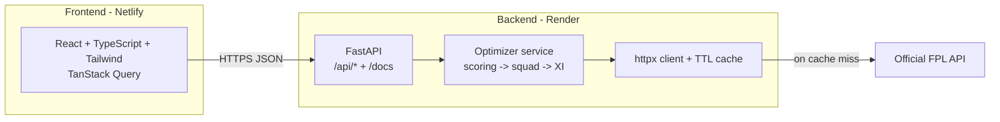

# ProFantasyAI

> Builds the mathematically optimal Fantasy Premier League squad from live data, then visualises it on an interactive pitch.

[](https://github.com/yusufkhan01/ProFantasyAI/actions/workflows/ci.yml)
[](LICENSE)


ProFantasyAI pulls every player from the official Fantasy Premier League (FPL) API and assembles the
**points-maximising** legal 15-man squad for a chosen season under the real FPL constraints — solved
exactly, not greedily. It then selects the optimal starting XI, formation and captain, and serves it
through a typed REST API and a modern React dashboard. A separate normalised **value model** powers the
"best value players" leaderboard.

Two seasons are available:

- **2025/26 (actual)** — the best XI you *could have* assembled at the start of the season, using real
  results and season-start prices.
- **2026/27 (predicted)** — the best squad to target, ranked by an expected-points (xP) model projected
  from 2025/26 underlying numbers (since the upcoming season isn't published by the FPL API yet).

**Live demo:** _Frontend_ — `https://<your-site>.netlify.app` · _API docs (Swagger)_ — `https://<your-api>.onrender.com/docs`
<!-- These URLs are filled in once the app is deployed (see Deployment). -->

---

## Features

- **Exact squad optimisation** — maximises total points across 15 players under the £100m budget, the 2/5/5/3 positional split, and the max-3-players-per-club rule, using per-position knapsack dynamic programming and an optimal budget split (no value left on the table the way greedy sorting does).
- **Season modes** — build for a past season (actual points, season-start prices) or a future one (projected expected points).
- **Expected-points projection** — a transparent xP model (regressed per-90 rates from xG/xA + minutes) projects the upcoming season from the latest completed one.
- **Normalised value model** — min-max normalises each metric (points-per-cost, form, points-per-game, ICT index) before weighting, powering the "best value players" leaderboard.
- **Starting XI, formation & captain** — searches every legal formation to field the highest-scoring XI and names the highest-scoring starter as captain.
- **Live data with caching** — fetches the FPL API through an async `httpx` client with a TTL cache to stay fast and gentle on the upstream.
- **Interactive dashboard** — the XI rendered on a football pitch, a stats summary, the bench, and a "best value players" ranking.
- **Auto-generated API docs** — interactive Swagger UI at `/docs` and OpenAPI at `/openapi.json`.
- **Production-minded** — typed end to end, unit/integration tested, linted, containerised, and CI-checked.

## Screenshots

<!-- Add a screenshot of the running dashboard, then enable the line below: -->
<!--  -->

The dashboard shows the optimal starting XI on a pitch (colour-coded by position, with a captain badge),
a stats bar (formation, squad cost, money in the bank, projected points, captain), the four-man bench, and a
ranked list of the best value-for-money players.

## Architecture



The frontend is a static SPA that talks to the FastAPI backend over JSON. The backend keeps no database:
it fetches the FPL `bootstrap-static` payload (cached), runs the pure-Python optimiser, and returns typed
responses validated by Pydantic.

## Tech stack

| Layer | Technologies |
| --- | --- |
| Backend | Python 3.12, FastAPI, Pydantic v2, httpx, Uvicorn |
| Frontend | React 19, TypeScript, Vite, Tailwind CSS v4, TanStack Query |
| Tooling | Ruff, pytest, ESLint, Vitest, Testing Library |
| Infra | Docker, docker-compose, GitHub Actions, Render, Netlify |

## How the optimizer works

**1. Resolve the season.** Each player gets a price and an *objective* (the number we maximise):

- **2025/26 (actual):** season-start price (`now_cost - cost_change_start`) and **actual** total points.
- **2026/27 (predicted):** current price as a proxy and **projected** points (see below).

**2. Exact squad construction.** Instead of greedily sorting, the squad that **maximises total objective
points** is found exactly via dynamic programming:

- a per-position knapsack computes the best return for *exactly* k players at every budget level,
- those four curves are convolved to find the optimal split of the £100.0m budget across positions,
- the result respects 2 GK / 5 DEF / 5 MID / 3 FWD and the max-3-players-per-club cap (the rare case where
  the unconstrained optimum stacks one club is repaired with a constraint-preserving local search).

On live data this typically scores ~9–10% more points than the old greedy value-based pick for the same
£100m — mostly by spending the budget that greedy left in the bank.

**3. Expected-points projection (future seasons).** Projected points blend a player's actual points-per-90
with an underlying estimate from expected goals/assists and an expected clean-sheet rate, regress it
towards the position mean (shrinking low-minute players harder), and scale by projected minutes. Every
constant lives in [`projection.py`](backend/app/services/projection.py) and is easy to tune.

**4. Starting XI, formation & captain.** Every legal formation (1 GK, 3-5 DEF, 2-5 MID, 1-3 FWD totalling
11) is evaluated; the highest-scoring valid XI wins, the remaining four players form the bench, and the
highest-scoring starter is named captain.

**Value model (leaderboard).** The "best value players" ranking still scores each available player by
normalising four metrics and combining them with fixed weights:

```
value = 0.45 * norm(points_per_cost)
      + 0.25 * norm(form)
      + 0.20 * norm(points_per_game)
      + 0.10 * norm(ict_index)
```

where `norm(x)` is min-max scaling to `[0, 1]`, reported on a `0-100` scale.

## Project structure

```
ProFantasyAI/
├── backend/                 # FastAPI service
│   ├── app/
│   │   ├── api/routes.py     # HTTP endpoints
│   │   ├── core/constants.py # FPL rules (budget, positions, formations)
│   │   ├── models/schemas.py # Pydantic response models
│   │   ├── services/
│   │   │   ├── fpl_client.py  # cached async FPL API client
│   │   │   ├── optimizer.py   # exact points-maximising squad + XI + value model
│   │   │   └── projection.py  # expected-points (xP) model for future seasons
│   │   ├── config.py
│   │   └── main.py
│   ├── tests/                # pytest suite (offline, fixture-driven)
│   ├── Dockerfile
│   └── requirements*.txt
├── frontend/                # Vite + React + TS dashboard
│   ├── src/
│   │   ├── api/client.ts      # typed API client
│   │   ├── components/        # Pitch, PlayerToken, Bench, StatsSummary, ...
│   │   ├── hooks/useFplData.ts
│   │   └── App.tsx
│   ├── Dockerfile
│   └── nginx.conf
├── .github/workflows/ci.yml # backend + frontend CI
├── docker-compose.yml
├── render.yaml              # backend deploy blueprint
└── netlify.toml             # frontend deploy config
```

## Getting started

### Prerequisites

- Python 3.11+ and Node.js 20+ (for the manual setup), **or**
- Docker (for the one-command setup).

### Option A - Docker (one command)

```bash
docker compose up --build
```

- Frontend: http://localhost:8080
- API + Swagger docs: http://localhost:8000/docs

### Option B - Run locally

**Backend**

```bash
cd backend
python -m venv venv && source venv/bin/activate   # Windows: venv\Scripts\activate
pip install -r requirements-dev.txt
cp .env.example .env                               # optional: tweak CORS / cache
uvicorn app.main:app --reload                      # http://localhost:8000/docs
```

**Frontend** (in a second terminal)

```bash
cd frontend
npm install
cp .env.example .env                               # VITE_API_BASE_URL=http://localhost:8000
npm run dev                                        # http://localhost:5173
```

## API reference

Base path: `/api`. Full interactive documentation is available at `/docs`.

| Method | Endpoint | Description |
| --- | --- | --- |
| `GET` | `/api/health` | Liveness probe. |
| `GET` | `/api/optimal-team?season=` | The points-maximising squad, starting XI, formation, captain and metrics. `season` is `2025-26` (actual, default) or `2026-27` (projected). |
| `GET` | `/api/players?limit=&position=` | Best value players, optionally filtered by `GK\|DEF\|MID\|FWD`. |

## Testing

```bash
# Backend: lint, format check, and tests
cd backend
ruff check . && ruff format --check . && pytest

# Frontend: lint, typecheck, unit tests, and build
cd frontend
npm run lint && npm run typecheck && npm run test && npm run build
```

All checks also run automatically on every push and pull request via [GitHub Actions](.github/workflows/ci.yml).

## Deployment

The app is designed as two decoupled services:

- **Backend → Render** using [`render.yaml`](render.yaml) (Docker web service). Set `ALLOWED_ORIGINS` to your Netlify URL.
- **Frontend → Netlify** using [`netlify.toml`](netlify.toml). Set `VITE_API_BASE_URL` to your Render API URL.

See the step-by-step [deployment guide](docs/DEPLOYMENT.md) for the full walkthrough. After deploying, fill the
live URLs into the demo links at the top of this README.

## Roadmap

- ~~Exact optimisation instead of a greedy heuristic.~~ ✅ Done (per-position knapsack + budget-split DP).
- ~~Season modes (actual vs projected).~~ ✅ Done.
- Richer xP: fixture-difficulty adjustment, new-signing/promoted-team handling, and minutes modelling beyond last season.
- Validate/back-test the projection model and expose tunable weights and multiple scoring models.
- Player search, comparison and filtering.
- Historical gameweek analysis and transfer suggestions.

## License

Released under the [MIT License](LICENSE).

ProFantasyAI is an independent project and is not affiliated with, endorsed by, or associated with the
Premier League or the Fantasy Premier League. Player data belongs to its respective owners.
